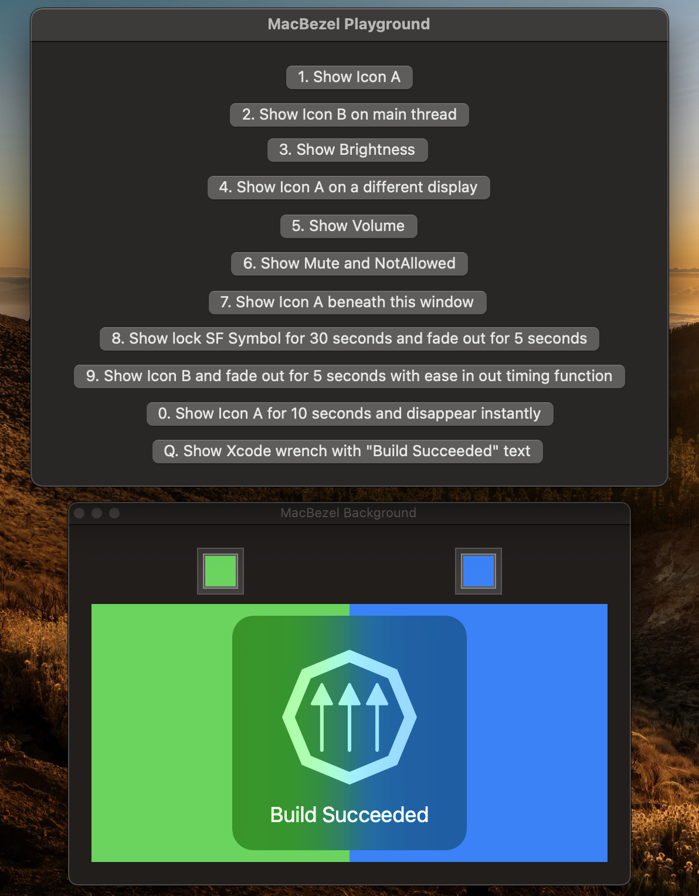

<h1 align="center">MacBezel</h1>

<p align="center">Mimic the macOS bezel</p>

<p align="center"></p>

## Installation

Add the following to your `dependencies` in `Package.swift`:

```swift
.package(url: "https://github.com/dimitarnestorov/MacBezel", .upToNextMinor(from: "0.1.0")),
```

## Usage

```swift
import MacBezel

Bezel.show(NSImage(named: "done")!, options: [.text: "Done"])
```

### Using SF Symbols

```swift
import MacBezel

let image = NSImage(systemSymbolName: "lock", accessibilityDescription: nil)!
    .withSymbolConfiguration(.init(pointSize: 500, weight: .medium, scale: .large))!
    .resizeForBezel()
Bezel.show(image, options: [.text: "Locked"])
```

## Icon spec

Icons should be 174 x 174 points. Icons that will be displayed with the text option should position their content in a 115 x 115 points padded 29.5 points from the left and 43 points from the bottom.

For best results use a vector image and set "Render As" to "Template Image".

If you want to use an SF Symbol or another icon library MacBezel comes with an extension to `NSImage`:

```swift
/// Returns a new NSImage appropriately resized for MacBezel
func resizeForBezel() -> NSImage
```

## Playground

[Open with Xcode](https://open-with-xcode.vercel.app/?repo=https%3A%2F%2Fgithub.com%2Fdimitarnestorov%2FMacBezel) (switch the destination to "My Mac")
